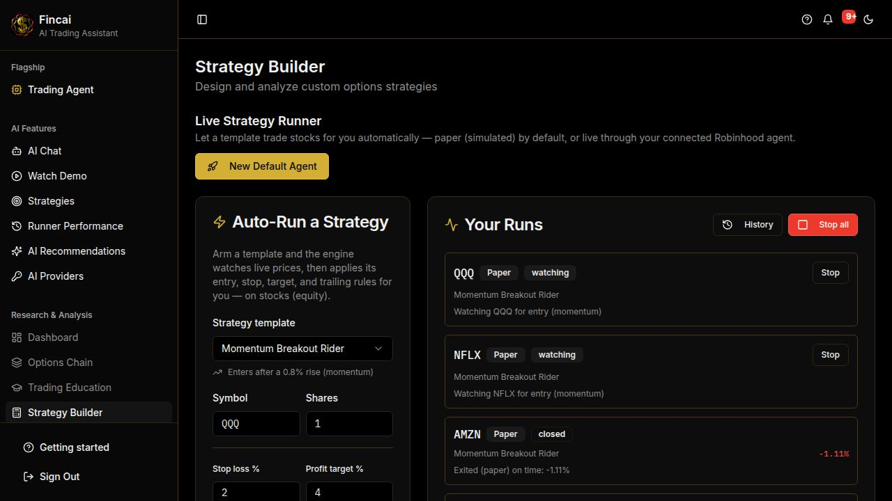
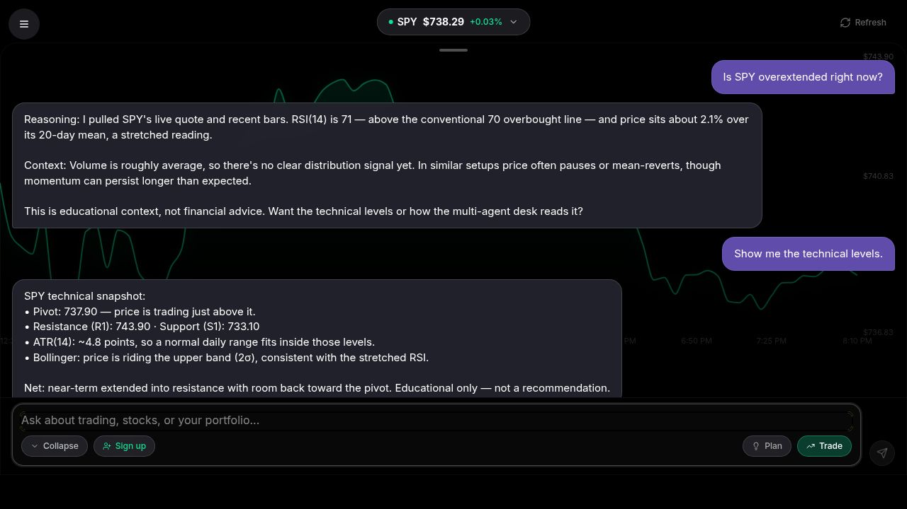
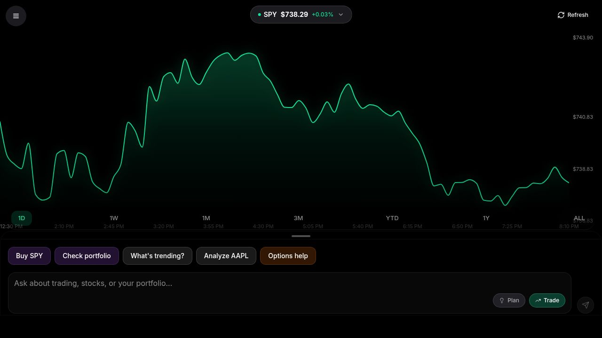

# Fincai

**An AI trading agent you connect to your own brokerage — not another chatbot with a stock widget.**

Fincai's flagship feature is real agentic brokerage connectivity: a live AI agent that links to **Robinhood's Agentic Trading MCP** over OAuth 2.1, watches live market data, analyzes positions with a multi-agent AI desk, and — within limits you set — runs strategy templates autonomously on real equities.

> Fincai is not affiliated with or endorsed by Robinhood Markets, Inc.


**Live app:** [fincai.ai](https://fincai.ai) · **PRD:** [PRD.md](./PRD.md) · **AI rules file:** [.cursorrules](./.cursorrules)



*Screenshots show illustrative software behavior, not trading results.*

---

## For Hackathon Judges — 2-Minute Tour

**What we built.** An AI trading platform whose agent terminal holds a real, OAuth-authorized MCP connection to Robinhood's agentic trading program — plus an autonomous strategy runner that trades curated templates under code-enforced limits, a multi-agent AI analysis desk, and a broker-independent options pricing engine. Live at [fincai.ai](https://fincai.ai); mission and scope are locked in the [PRD](./PRD.md).

**How we built it.** Vibe-coded with Cursor throughout. AI-assisted development ran under explicit, enforced rules — published in this repo's [`.cursorrules`](./.cursorrules): compliance-linted public copy (a CI test in this repo scans this very README), a no-fabricated-data rule, and safety-first defaults for everything that can touch a live brokerage account.

**What's next.** Options and short-direction execution as Robinhood's agentic program expands beyond long equities; per-template run history and exportable results; more agentic-broker connections as other brokers expose MCP endpoints. (Directional roadmap — details in the [PRD](./PRD.md#9-rollout).)

**Try it in 60 seconds — no account, no brokerage needed:**

1. Open [fincai.ai](https://fincai.ai) — with no agent connected, the terminal runs a clearly-labeled demo preview.
2. Ask the [AI desk](https://fincai.ai/chat) to analyze SPY — multi-agent analysis over live market data.
3. Arm a paper strategy at [/builder](https://fincai.ai/builder): pick a template, keep the default paper mode, and watch it appear under active runs.
4. Prefer a guided pass? The cinematic tour at [/promo](https://fincai.ai/promo) walks every feature.

> The live Robinhood connection itself requires enrollment in Robinhood's agentic trading program and a funded, dedicated agentic account — the screenshots in this README stand in for that surface. Everything else above is open to evaluate.

Engineering highlights are indexed in the [Code Tour](#code-tour) below.

---

## Why Fincai

- **A real brokerage connection, not a mock.** The agent terminal speaks MCP (Streamable HTTP) to Robinhood's agentic trading endpoint, authorized through OAuth 2.1 with PKCE and dynamic client registration.
- **An autonomous strategy runner with a code-enforced safety model.** Paper (simulated) trading is the default; live trading is a separate, explicit per-run opt-in with hard caps, market-hours gating, and pause-for-human-review semantics.
- **A multi-agent AI analysis desk.** Technical, sentiment, and fundamental agents plus a bull/bear debate — run on the built-in Claude or your own OpenAI/Gemini key.
- **A Black-Scholes and Bjerksund-Stensland options pricing engine.** Concrete, verifiable quantitative methods instead of marketing superlatives.
- **Honest by design.** When a data feed fails, the UI says "unavailable" — it never invents numbers. Simulated data appears only where it is clearly labeled (demo preview, paper runs).

---

## Code Tour

Where to look first, in order of engineering interest:

| If you want to see… | Read |
|---|---|
| The Robinhood MCP client — OAuth 2.1 + PKCE + dynamic client registration, encrypted token storage, lazy session restore | `server/robinhood-mcp.ts` |
| The autonomous runner — state machine, paper/live split, fail-closed caps, atomic order claims, pause-on-uncertainty | `server/strategy-runner.ts` + `server/strategy-run-limits.ts` |
| The compliance gate that lints this README and the PRD in CI | `client/src/test/compliance-ci-checks.test.ts` |
| Canonical risk & disclosure copy as importable code | `shared/disclosures.ts` |
| The options pricing engine spec, traceable to its implementation | `shared/engine-spec.ts` + `server/pricing/` |
| Market-data provider chain, cache tiers, and the per-decision audit log | `server/market-data.ts` |

---

## The Agentic Terminal

The heart of Fincai is the agent terminal at `/`. Connect it to Robinhood and a live AI agent gets a real seat at your trading desk: it discovers the broker's MCP tools at runtime, reads your portfolio, streams its activity into a live feed (tool calls, results, errors), and places manual trades through chat — each manual order goes through an explicit in-app confirmation step before it is sent. When no agent is connected, the terminal shows a clearly-labeled demo preview instead.

### How the connection works

1. **Connect** — the server registers a dynamic OAuth client with Robinhood's authorization server (OAuth 2.1 + PKCE, no static client secret). The callback URL is derived from trusted server configuration only, never from request headers.
2. **Authorize** — you approve the agent in a desktop browser *and* confirm in the Robinhood mobile app. The permissions granted are determined by Robinhood's authorization server during this flow.
3. **Agent goes live** — an MCP session opens over Streamable HTTP to `https://agent.robinhood.com/mcp/trading`, and the agent lists the broker's available tools at runtime.
4. **Stays connected** — OAuth client info and tokens are stored AES-256-GCM-encrypted (key derived from `SESSION_SECRET`), keyed by an HttpOnly session cookie, and lazily restored after server restarts. Disconnecting deletes the stored credentials; you can also revoke access any time from your Robinhood settings.

### What Robinhood requires on its side

- Enrollment in **Robinhood's agentic trading program**.
- A dedicated, separately funded **Agentic account** — the agent can read your accounts, but per Robinhood's program it places trades only in that dedicated account.
- Authorization on desktop **plus** confirmation in the Robinhood mobile app.
- **Equities only at the program's launch** — options, crypto, and other asset classes are not yet exposed by Robinhood's MCP tools.

---

## Autonomous Strategy Runner

Strategy templates in Fincai are not static catalog entries — a server-side engine actually runs them. Arm a template (symbol, share count, editable stop/target/trailing/time rules) and the engine watches live quotes, applies the template's entry trigger, and manages the position through its exit rules. Each run moves through an explicit state machine (`watching → entering → in_position → exiting → closed`, plus `error`/`paused`), survives server restarts, and can be stopped individually or via a kill switch.

The template catalog includes momentum breakout, mean-reversion fade, AI-consensus convergence, and fair-value edge templates, plus a set of quant playbooks adapted from trading-desk methodologies (time-series momentum, cross-sectional factor momentum, statistical-arbitrage mean reversion, volatility premium, risk-parity core). Short-direction and volatility templates are paper-only in V1 and labeled as such.

### Safety model (enforced in code, not just in copy)

- **Paper is the default.** Live mode is a separate, explicit opt-in for each run; anonymous users are paper-only.
- **Armed once, then trades within the limits you set.** A live run places and closes orders automatically without a separate confirmation for each order — you can pause or stop it at any time.
- **Long-only and equities-only in V1.** The live entry path fail-closed guards on direction; short-direction templates are forced to paper.
- **Hard position caps** (max quantity and max notional) are centralized and re-checked against the live price at entry time, not just at creation.
- **Market-hours guard** gates live entries and exits.
- **Uncertain outcomes pause, never retry.** If an order's outcome is unknown — a failed call, or a restart while an order was in flight — the run is paused for human review. It is never automatically re-placed, because the order may have actually executed at the broker.
- **Atomic order claims.** The order-placing transitions (entering and exiting a position) are claimed with an atomic compare-and-set, so the engine tick and a manual Stop can't act on the same run twice.
- **Honest triggers.** Entry/exit signals are computed from live quotes and labeled as such in the UI.

---

## The AI Analysis Desk



- **Conversational trading copilot** — Claude-powered chat with ReAct reasoning, token streaming, an intent-first message router, and function tools for live market operations. A Trade/Plan toggle controls whether the AI may stage orders at all, and staged orders go through an explicit in-app confirmation step before they are sent.
- **Multi-agent analysis** — specialized technical, sentiment, and fundamental agents, a bull/bear debate, and market-regime detection, surfaced in chat and on the analysis pages.
- **Bring your own model** — analysis can run on your own OpenAI or Google Gemini key (connected in-app, per session). If your provider fails mid-run, the system falls back to Claude and says so in a provenance line. Tool-calling chat stays on Claude by design.
- **Position analysis tools** — moneyness, time decay, scenario generation, breakeven analysis, exit-strategy and rolling analysis, position comparison.

---

## Options Analytics

Fincai ships a broker-independent **Black-Scholes and Bjerksund-Stensland options pricing engine** (`shared/engine-spec.ts` is the canonical, code-traceable spec):

- European-style contracts priced with Generalized Black-Scholes (Black-Scholes-Merton for equities, Black-76 for futures, Garman-Kohlhagen for FX); American-style contracts with the Bjerksund-Stensland (2002) closed-form approximation.
- Greeks from closed-form partial derivatives (delta, gamma, theta, vega, rho).
- Implied volatility solved by Newton-Raphson with a Brent's-method fallback for low-vega wings (tolerance 1e-8).
- Discounting from an interpolated U.S. Treasury yield curve (natural cubic spline), dividends modeled as a continuous yield.
- A per-strike volatility surface with optional SVI smoothing, put-call parity validation, confidence scoring, and an interactive IV heatmap.

Supporting tools: options chain browser, strategy builder with payoff diagrams, Greeks visualizer, position sizing, P&L simulator, and a VaR calculator.

---

## Live Market Data



- **Alpha Vantage and Alpaca Market Data** in a redundant provider chain: quotes try Alpha Vantage first, then Alpaca; historical bars and options snapshots come from Alpaca Market Data.
- Multi-tier caching — a hot cache in front of the main cache, plus a stale-while-revalidate window that serves slightly-aged data while a background refresh runs.
- A persistent **audit log** records every provider decision — cache hit, fresh fetch, rate limit, error — with latency and status, queryable through an admin endpoint.
- Failures are surfaced as "unavailable" states in the UI. Fincai does not fabricate market data.

---

## Also in the Box

- **Strategies hub** — build, save, analyze, and compare options strategies.
- **Watchlist & price alerts** with an in-app notification feed.
- **Trade journal** and **psychology tracker** for emotions, mistakes, and behavioral patterns.
- **Performance dashboard** for run history and trading metrics.
- **Trading education** pages and a cinematic product tour at `/promo`.
- **First-run onboarding** — guided walkthrough plus a getting-started checklist.

---

## Tech Stack

| Layer | Technology |
|-------|------------|
| Frontend | React 18, TypeScript 5.6, Vite 5, Tailwind CSS + shadcn/ui, TanStack Query, wouter, Recharts, Framer Motion |
| Backend | Express 4 on Node.js 22, TypeScript, WebSocket (ws), Zod |
| Agent connectivity | MCP TypeScript SDK (Streamable HTTP client, OAuth 2.1 + PKCE) |
| Database | PostgreSQL with Drizzle ORM |
| AI | Anthropic Claude (via Replit AI integration); optional user-connected OpenAI / Google Gemini for analysis |
| Market data | Alpha Vantage + Alpaca Market Data APIs |

---

## Getting Started

### Prerequisites

- Node.js 22+
- A PostgreSQL database
- API keys: Anthropic (or the Replit AI integration), plus market data — Alpha Vantage and/or an Alpaca Market Data key pair

### Setup

```bash
git clone https://github.com/BEXAI/Fincai.ai.git
cd Fincai.ai
npm install
cp .env.example .env   # fill in your values
npm run db:push        # push the Drizzle schema to your database
npm run dev
```

The app serves on `http://localhost:5000` (API and client on the same port).

### Environment variables

| Variable | Purpose | Required |
|----------|---------|----------|
| `DATABASE_URL` | PostgreSQL connection string | Yes |
| `SESSION_SECRET` | Sessions + AES-256-GCM encryption of stored agent credentials (min 16 chars) | Yes |
| `AI_INTEGRATIONS_ANTHROPIC_API_KEY` | Claude API key (auto-provided on Replit) | Yes |
| `AI_INTEGRATIONS_ANTHROPIC_BASE_URL` | Claude API base URL (auto-provided on Replit) | Yes |
| `ALPHA_VANTAGE_API_KEY` | Alpha Vantage — first in the quote provider chain | At least one source |
| `ALPACA_API_KEY` / `ALPACA_API_SECRET` | Alpaca Market Data key pair — quotes (second in chain), historical bars, options snapshots | At least one source |
| `ALPACA_CLIENT_ID` / `ALPACA_CLIENT_SECRET` | Alpaca OAuth client credentials — optional; the key pair above is what activates Alpaca data endpoints | No |
| `JWT_SECRET` | Auth token signing — falls back to `SESSION_SECRET` (one of the two must be set in production) | No |
| `APP_ORIGIN` / `PUBLIC_APP_URL` | Public origin for the Robinhood OAuth callback (derived automatically on Replit) | Self-hosted |
| `ALLOWED_ORIGINS` | Extra CORS origins, comma-separated | No |
| `ADMIN_EMAILS` | Emails granted admin endpoints, comma-separated | No |
| `NODE_ENV` / `PORT` | Environment mode / server port (default 5000) | No |
| `VITE_API_BASE_URL` / `VITE_WS_URL` | Only for split frontend/backend deployments | No |

OpenAI / Gemini keys for bring-your-own analysis are connected inside the app, not via environment variables.

### Scripts

| Command | Description |
|---------|-------------|
| `npm run dev` | Start the development server with hot reload |
| `npm run build` | Build frontend and backend for production |
| `npm run start` | Run the production build |
| `npm run check` | TypeScript type checking |
| `npm run db:push` | Push Drizzle schema changes to the database |
| `npx vitest run` | Run the test suite, including the compliance copy gate |

---

## Project Structure

```
├── client/
│   ├── public/                  # Static assets, robots.txt, sitemap, llms.txt
│   └── src/
│       ├── components/          # UI components (agent, chat, promo, shadcn/ui, …)
│       ├── pages/               # Routes: agent terminal, chat, strategy builder,
│       │                        #   options chain, volatility surface, journal, …
│       ├── hooks/  lib/         # Client hooks and utilities
│       └── test/                # Vitest suites, incl. compliance CI checks
├── server/
│   ├── robinhood-mcp.ts         # Robinhood Agentic Trading MCP connection manager
│   ├── strategy-runner.ts       # Autonomous strategy engine (state machine + safety)
│   ├── strategy-run-limits.ts   # Centralized position caps
│   ├── market-data.ts           # Alpaca/Alpha Vantage service, caching, audit log
│   ├── anthropic.ts             # Claude integration (ReAct chat, function tools)
│   ├── pricing/                 # Options pricing engine services
│   ├── routes/                  # Route modules (agent, ai, market, pricing, …)
│   ├── encryption.ts            # AES-256-GCM helpers for stored agent credentials
│   └── storage.ts  db.ts        # Drizzle data access
└── shared/
    ├── schema.ts                # Database schema + shared types
    ├── disclosures.ts           # Canonical disclosure & trademark copy
    ├── engine-spec.ts           # Code-traceable pricing-engine spec
    └── seo-config.ts            # Route SEO/GEO configuration
```

---

## Deployment

**Replit** — the repo is pre-configured: the workflow runs `npm run dev`, and publishing uses `npm run build` / `npm run start`. Set secrets in the Secrets tab.

> **Autonomous trading needs an always-on server.** The strategy runner is an in-process loop: on an autoscale deployment that scales to zero, the loop stops whenever the instance is torn down (runs resume on next boot; anything caught mid-order stays paused for review). Use a Reserved VM if you rely on unattended runs.

**Self-hosted** — `npm run build && npm run start` with `NODE_ENV=production`, a managed PostgreSQL, and `APP_ORIGIN` set so the Robinhood OAuth callback resolves to your public URL.

---

## Security Posture

Everything below is implemented in this repo and can be read in the code:

- OAuth callback URLs are built from trusted server configuration only — never from request headers — to prevent authorization-code redirection.
- Stored agent credentials are encrypted with AES-256-GCM using a key derived (scrypt) from `SESSION_SECRET`; disconnecting deletes them.
- Fincai never sees or stores your Robinhood password, and holds only the permissions you grant during authorization — revocable from Robinhood at any time.
- Fincai cannot deposit, withdraw, or transfer funds or securities out of your brokerage account.
- CSRF validation on state-changing API routes — authentication, agent connect/disconnect and broker tool calls, strategy runs, notifications, and AI analysis; rate limiting on authentication endpoints; JWT-based auth with user-scoped data access.

---

## Compliance & Disclaimers

All user-facing disclosure copy is centralized in `shared/disclosures.ts` and enforced by a CI gate (`client/src/test/compliance-ci-checks.test.ts`) that lints shipped copy — **including this README** — against over-claims and unreviewed performance claims.

**Trademarks.** Fincai is not affiliated with, endorsed by, or sponsored by Robinhood Markets, Inc. Robinhood and the Robinhood logo are trademarks of Robinhood Markets, Inc. Fincai connects to your Robinhood account through Robinhood's official Trading API, only with your explicit authorization, and only for as long as you keep that authorization active.

**Not investment advice.** Fincai is a software tool for market analysis and order entry. It is not an investment adviser, broker-dealer, or financial planner. Nothing Fincai produces is personalized investment advice, a recommendation to buy or sell any security, or an offer or solicitation of any kind.

**Trading risk.** Trading involves substantial risk, including the possible loss of the entire amount invested. Options carry additional risk and are not suitable for every investor. Before trading options, review the OCC's [Characteristics and Risks of Standardized Options](https://www.theocc.com/company-information/documents-and-archives/options-disclosure-document).

**Automated strategy risk.** Automated and agentic strategies can act faster than you can review them. Software fails, market data can be delayed or wrong, and connectivity can be interrupted. Risk controls reduce but do not eliminate the possibility of loss. You remain responsible for every position in your account.

**Your responsibility.** Manual trades require your explicit confirmation before they are sent. If you arm a strategy in live mode, you authorize it to place and close orders automatically within the limits you set, without a separate confirmation for each order — you can pause or stop it at any time.

**AI limitations.** Fincai's analysis is generated by AI systems that can be incomplete, out of date, or simply wrong — including in ways that read as confident and specific. Treat every output as a starting point for your own research, not a conclusion.

**No performance representations.** Fincai does not publish, promise, project, or imply any level of trading performance. Screenshots and demos in this README show illustrative software behavior, not trading results.

**Paper trading by default.** New accounts run in paper (simulated) mode by default. Live trading requires an explicit, separate opt-in.

---

## Contributing

1. Fork the repository and create a feature branch.
2. Make your changes; run `npm run check` and `npx vitest run` before submitting.
3. Note that user-facing copy (including this README) must pass the compliance lint.
4. Open a pull request.

---

**Fincai** · [fincai.ai](https://fincai.ai) · Not affiliated with or endorsed by Robinhood Markets, Inc.
